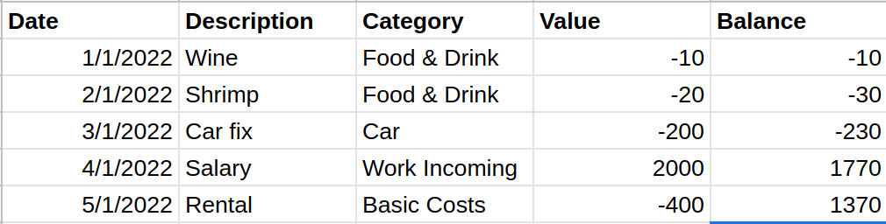
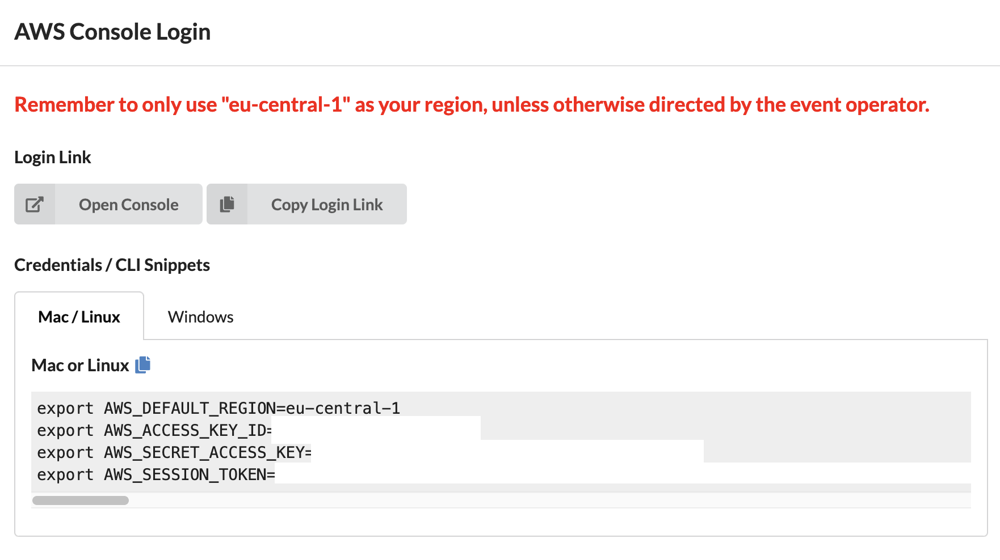
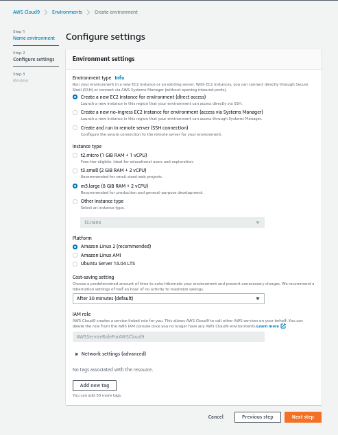
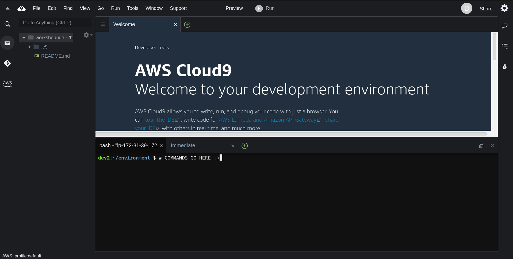
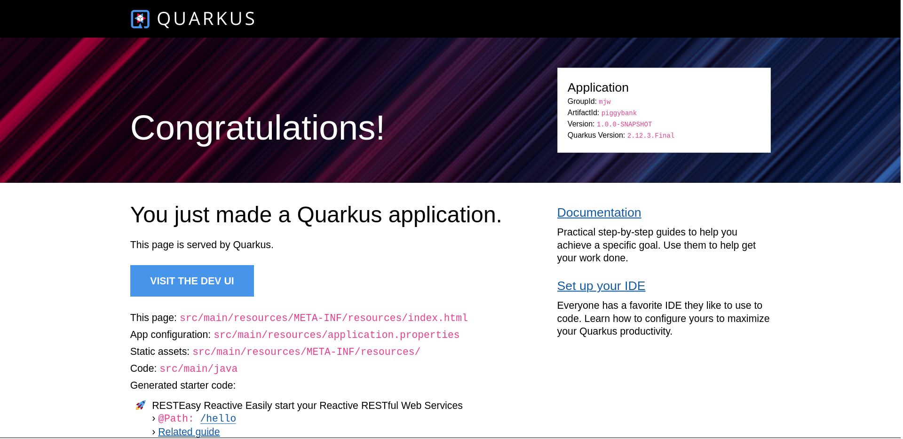
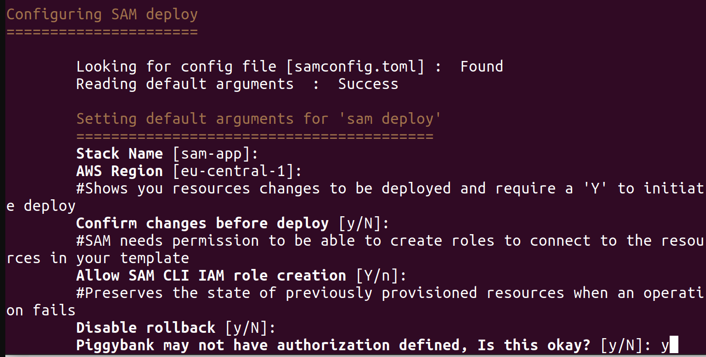
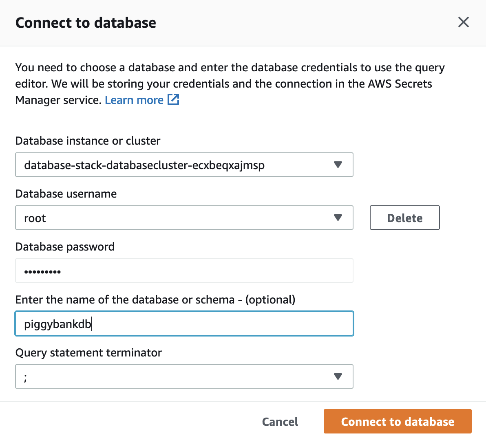

# Java Serverless Quarkus Workshop

## https://github.com/vsenger/quarkus-workshop

Hello Java Developers! Today we are going to build a modern, sustainable, low-code,
elegant, cloud native, multi-platform and scalable application with AWS + Java + Quarkus.

Quarkus is a Supersonic Subatomic Java Framework with some spices of
old but gold Java and Java EE API's like JPA, Dependency Injection, Hibernate
and amazing quarkus extensions to create RESTFul API's (not limited to!) with
low coding development and easy to deploy for containers, Lambda or
even hosting yourself to remember the old times :).


We are going to learn Quarkus by doing but if you want to learn
more details about Quarkus, please visit its website: https://quarkus.io/.

# Piggy Bank Project

The proposal of Piggy Bank is to replace personal finances spreadsheet with a Java
modern application that can be used as an architecture reference;
remember Petstore from J2EE??? Something like that but with modern Java!



The application will be able to import data from a spreadsheet, and Today we
are going to create the backend with RESTFul API to manage our financial data.

The main entity of the application is the Entry, that represents a financial transaction
from a single banking account:

> Entry Properties
> <ol>
> <li>uuid - Long - entry ID</li>
> <li>timeStamp - LocalDate - expense / entry date</li>
> <li>createStamp - LocalDateTime - entry creation date</li>
> <li>value - BigDecimal - expense / entry value</li>
> <li>description - String - entry description</li>
> <li>balance - BigDecimal - account balance</li>
> <li>category - String - expense / entry category</li>
> </ol>

In the end of this workshop you will have a complete backend application with RESTFul API
to manage your personal finances and also a routine to calculate account balance.

We are working on add-ons for this workshop that includes security, monitoring,
CI/CD, and more!

## Tasks Resume

Now that we provided some context, let's get our hands dirty with the following steps:

1. Setup your development environment
2. Create a Quarkus project
3. Run the application locally
4. Create a RESTFul API
5. Pack and deploy your Quarkus App as AWS Lambda
6. Create a serveless database
7. Create a Lambda function to ingest a CSV file on S3 and upload data to database
8. Some optional tasks: CI/CD and more..


## Clone or Fork this repo!

We recommend you fork this repository so that you can make changes to the code and commit them to your own repository.  This will allow you to easily track your progress and share your work with others.  You can fork this repository by clicking the "Fork" button in the upper right corner of this page.

## Soundcheck

Let's first make sure all tools are ready to go.

### AWS Account

Get your FREE AWS account for this workshop using the hash: 9549-1496715794-12

https://dashboard.eventengine.run/dashboard

Log using your email / OTP, click AWS Console to access your credentials:



Please check that can log in to the AWS Management console at https://console.aws.amazon.com/

You can also request free account at [https://aws.amazon.com/free/](https://aws.amazon.com/free/).

#### Cloud 9 Development Environment (default)

AWS Cloud9 is a development environment you can use directly from your AWS account.

[Create a Cloud9 environment](https://eu-central-1.console.aws.amazon.com/cloud9/home), you can use any name (e.g. "workshop-ide") and the default settings, except for the instance type. Please select the 'm5.large' instance type.



You will be redirected to the Cloud9 IDE, where you can start coding.
Let's now setup the development environment. Execute the commands below using the terminal in the Cloud9 IDE.




First, let's modify the EBS volume size, as the default 10G is not sufficient.
```bash
INSTANCE_ID=$(curl -s http://instance-data/latest/meta-data/instance-id)
echo "$INSTANCE_ID"

VOLUME_ID=$(aws ec2 describe-instances --instance-ids=$INSTANCE_ID --query "Reservations[0].Instances[0].BlockDeviceMappings[0].Ebs.VolumeId" --output text)
aws ec2 modify-volume --volume-id $VOLUME_ID --size 128
```

After the volume is modified, grow the partition and filesystem:
```bash
sudo growpart /dev/xvda 1
sudo xfs_growfs -d /
```

Install SDKMan, so we can install Java and other tools:
```bash
curl -s "https://get.sdkman.io" | bash
source "/home/ec2-user/.sdkman/bin/sdkman-init.sh"
```

Install Maven and Quarkus:
```bash
sdk install maven
sdk install quarkus
```

## Clone github repository

```bash
git clone https://github.com/vsenger/quarkus-workshop
```

##### Local Development Environment *(optional)*

You can also use your local computer if you prefer, just check that you have installed the required tools as mentioned below.

### Java Virtual Machine

Make sure you have Java installed, at least version 11. You can check your Java version by running the following command:

```bash
java -version
```

The recommended Java Virtual Machine for this workshop is Amazon Corretto 11, which you can download and install from https://aws.amazon.com/corretto/ or using [SDKMan](httpsL//sdkman.io):
```bash
sdk install java 11.0.16-amzn
```

*Why Java 11, not 19?*

At the time of this writing, Amazon Lambda natively supports Java 11. We'll be using that version in all compute environments for simplicity. It's possible to use later versions by using containers or cross-compiling.

### Apache Maven

Make sure you have Apache Maven installed, at least version 3.6. You can check your Maven version by running the following command:

```bash
mvn -version
```

### AWS Command Line Interface

The AWS Command Line Interface (CLI) is a unified tool to manage your AWS services. You should have the AWS CLI installed already, or proceed to install it following the instructions at https://docs.aws.amazon.com/cli/latest/userguide/install-cliv2.html

```bash
aws --version
```

To install AWS CLI V2:
```bash
sudo yum -y remove awscli
curl "https://awscli.amazonaws.com/awscli-exe-linux-x86_64.zip" -o "awscliv2.zip"
unzip awscliv2.zip
sudo ./aws/install
```

### AWS SAM CLI

The AWS Serverless Application Model (SAM) is an open-source framework for building serverless applications. You should have the AWS SAM CLI installed already, or proceed to install it following the instructions at https://docs.aws.amazon.com/serverless-application-model/latest/developerguide/serverless-sam-cli-install.html

```bash
sam --version
```

To install AWS SAM CLI:
```bash
wget https://github.com/aws/aws-sam-cli/releases/latest/download/aws-sam-cli-linux-x86_64.zip
unzip aws-sam-cli-linux-x86_64.zip -d sam-installation
sudo ./sam-installation/install --update
```

### Quarkus CLI

We'll be using the [Quarkus Command Line Interface](https://quarkus.io/guides/cli-tooling) to create and manage projects. Check that it is properly installed by running the following command:

```bash
quarkus --version
```

To install Quarkus CLI, if necessary:
```
sdk install quarkus
```
Quarkus References:
* All config options: https://quarkus.io/guides/all-config
* Quarkus cheat sheet: https://lordofthejars.github.io/quarkus-cheat-sheet/


In this workshop, Quarkus is used as a reference implementation. If you'd prefer, feel free to adapt and use any other framework, such as Spring Boot, Micronaut, JHipster or even plain Java.

*Awesome! You're ready to go!*


## Task 1: Project Setup

Let's create a new project named "piggybank" (artifactId), in the "mjw" group, using Java 11 as the language and Apache Maven as the build tool.

```bash
quarkus create app --java=11 --maven mjw:piggybank
```

Start the application in development mode, using the [maven wrapper](https://www.baeldung.com/maven-wrapper):
```bash
cd piggybank
./mvn quarkus:dev
```
Quarkus development mode will run in this terminal, in the foreground, accepting commands and restarting the application automatically as you change it.

In a new terminal, "visit" you application at http://localhost:8080
```bash
curl http://localhost:8080
```
On C9: Preview > Preview running applciation
On GitPod: Click the link or visit the port URL



Also, test the [JAX-RS resource class](https://www.baeldung.com/jax-rs-spec-and-implementations) that was generated in `src/main/java/mjw/GreetingResource.java`:

```bash
curl -v http://localhost:8080/hello
```

Generate an application package:
```bash
./mvn package
```

Check the generated package size and structure:
```
du -h target/quarkus-app/
```

Run the application package (production profile):
```bash
java -jar target/quarkus-app/quarkus-run.jar
```

## Task 2: Adding a Local Database

Let's add a MySQL relational database to our application, first locally then using AWS Services.

### Java Database Connectivity (JDBC) and Local MySQL

In Quarkus, we add features as extensions. Let's add the [Agroal](https://quarkus.io/guides/datasource) extension for datasource management (including connection pooling) and the MySQL JDBC driver and tools.
```
quarkus ext add agroal jdbc-mysql
```

Let's add a simple "health check" class that only connects to the database and verify that it's running and reachable:

Add the following code to `src/main/java/mjw/HealthCheckResource.java`
```java
package mjw;

import java.sql.SQLException;

import javax.inject.*;
import javax.sql.*;
import javax.ws.rs.*;
import javax.ws.rs.core.MediaType;

@Path("/_hc")
public class HealthCheckResource {
    private static final int DB_CONN_TIMEOUT_SEC = 10;
    private static final String createTableSQL = "CREATE TABLE IF NOT EXISTS entry (uuid int not null primary key auto_increment, timeStamp  date, createStamp  datetime, value decimal(10,2), balance decimal(10,2), category varchar(255), description varchar(255));";

    @Inject
    DataSource ds;

    @GET
    @Produces(MediaType.TEXT_PLAIN)
    public String healthCheck() {
        try (var conn = ds.getConnection()){
            conn.isValid(DB_CONN_TIMEOUT_SEC);
        }catch(SQLException ex){
            throw new WebApplicationException("Could not connect to database", 500);
        }
        return "Application is healthy";
    }
    @Path("createTable")
    @GET
    public String createTable() {
        try (var conn = ds.getConnection();
             var stmt = conn.createStatement()){
            stmt.execute(createTableSQL);
            return "Table created!";
        }catch(SQLException e){
            return "Error creating table: " + e.getMessage();
        }
    }
}
```
Terminate (ctrl+c) and re-start your application.

Check that the database is up and reachable:
```bash
curl -v http://localhost:8080/_hc
```

*Where is that database?*
[Quarkus Dev Services](https://quarkus.io/guides/datasource#dev-services)
will automatically start a MySQL database in a Docker container,
and configure the application to use it in development mode.

## Task 3: Creating Entry Entity and REST API

Now let's add some quarkus extensions to create our REST API, can do it by using quarkus ext add "extension"
or we can go direct to our pom.xml and make sure that we have all dependencies as follows:

```xml
  <dependencies>
    <dependency>
        <groupId>io.quarkus</groupId>
        <artifactId>quarkus-arc</artifactId>
    </dependency>
    <dependency>
        <groupId>io.quarkus</groupId>
        <artifactId>quarkus-resteasy</artifactId>
    </dependency>
    <dependency>
        <groupId>io.quarkus</groupId>
        <artifactId>quarkus-agroal</artifactId>
    </dependency>
    <dependency>
        <groupId>io.quarkus</groupId>
        <artifactId>quarkus-jdbc-mysql</artifactId>
    </dependency>
    <dependency>
        <groupId>io.quarkus</groupId>
        <artifactId>quarkus-hibernate-orm</artifactId>
    </dependency>
    <dependency>
        <groupId>io.quarkus</groupId>
        <artifactId>quarkus-hibernate-orm-panache</artifactId>
    </dependency>
    <dependency>
        <groupId>io.quarkus</groupId>
        <artifactId>quarkus-flyway</artifactId>
    </dependency>
    <dependency>
        <groupId>org.flywaydb</groupId>
        <artifactId>flyway-mysql</artifactId>
    </dependency>
    <dependency>
        <groupId>io.quarkus</groupId>
        <artifactId>quarkus-resteasy-jackson</artifactId>
    </dependency>
    <dependency>
        <groupId>io.quarkus</groupId>
        <artifactId>quarkus-hibernate-orm-rest-data-panache</artifactId>
    </dependency>
    <dependency>
        <groupId>io.quarkus</groupId>
        <artifactId>quarkus-amazon-lambda-http</artifactId>
    </dependency>
    <dependency>
        <groupId>io.quarkus</groupId>
        <artifactId>quarkus-junit5</artifactId>
        <scope>test</scope>
    </dependency>
    <dependency>
        <groupId>io.rest-assured</groupId>
        <artifactId>rest-assured</artifactId>
        <scope>test</scope>
    </dependency>
</dependencies>

```

Let's create our Entry entity adding the following code to `src/main/java/mjw/Entry.java`

```java
package mjw;

import io.quarkus.hibernate.orm.panache.PanacheEntityBase;

import javax.persistence.*;
import java.math.BigDecimal;
import java.time.LocalDate;
import java.time.LocalDateTime;
import java.util.Objects;

@Entity
@Table(name = "entry")
@NamedQueries({
        @NamedQuery(name="Entries.findAll",
                query = "select e from Entry e order by e.timeStamp asc, e.uuid asc")
})
public class Entry extends PanacheEntityBase {
    @Id
    @GeneratedValue(strategy = GenerationType.IDENTITY)
    Long uuid;

    LocalDate timeStamp;
    LocalDateTime createStamp;
    BigDecimal value;
    String description;
    BigDecimal balance;
    String category;

    public Entry(){}

    public Entry(LocalDate timeStamp, BigDecimal value, String description, String category) {
        this.timeStamp = timeStamp;
        this.value = value;
        this.description = description;
        this.category=category;
        this.createStamp=LocalDateTime.now();
    }

    public String getCategory() {
        return category;
    }

    public String getTimeStampStr() {
        return timeStamp.toString();
    }

    public BigDecimal getValue() {
        return value;
    }

    public String getDescription() {
        return description;
    }

    public BigDecimal getBalance() {
        return balance;
    }

    public void setBalance(BigDecimal balance) {
        this.balance = balance;
    }

    public LocalDate getTimeStamp() {
        return timeStamp;
    }

    public LocalDateTime getCreateStamp() {
        return createStamp;
    }
    public Long getUuid() {
        return uuid;
    }

    @Override
    public boolean equals(Object o) {
        if (this == o) return true;
        if (o == null || getClass() != o.getClass()) return false;
        Entry entry = (Entry) o;
        return Objects.equals(uuid, entry.uuid) && Objects.equals(timeStamp, entry.timeStamp) && Objects.equals(createStamp, entry.createStamp) && Objects.equals(value, entry.value) && Objects.equals(description, entry.description) && Objects.equals(balance, entry.balance) && Objects.equals(category, entry.category);
    }

    @Override
    public int hashCode() {
        return Objects.hash(uuid, timeStamp, createStamp, value, description, balance, category);
    }

}
```

Now we are going to create a very simple resource / controller to test our project before doing
some quarkus magic.

Add this code to `src/main/java/mjw/EntrySimpleController.java`

```java
package mjw;

import javax.inject.Inject;
import javax.persistence.EntityManager;
import javax.transaction.Transactional;
import javax.ws.rs.*;

import javax.ws.rs.core.MediaType;
import java.math.BigDecimal;
import java.time.LocalDate;

import java.time.format.DateTimeFormatter;
import java.util.List;

@Path("/entryResource")
public class EntrySimpleController {
    @Inject
    EntityManager em;
    private static final DateTimeFormatter formatter = DateTimeFormatter.ofPattern("yyyy-MM-dd");

    @Path("new")
    @GET
    @Transactional
    public Entry getNew(@QueryParam("categoryID") String category,
                        @QueryParam("description") String description,
                        @QueryParam("amount") BigDecimal amount,
                        @QueryParam("date") String date){
        var tx = new Entry(LocalDate.parse(date, formatter), amount, description, category);
        tx.persist();
        return tx;
    }
    @Path("findAll")
    @GET
    @Transactional
    public List<Entry> findAll(){
        return em.createNamedQuery("Entries.findAll", Entry.class)
                .getResultList();

    }

    @Path("find")
    @GET
    @Transactional
    public List<Entry> findByDescription(@QueryParam("description") String description){
        return Entry.find("description", description).list();
    }


}
```

We can test our project with the following command:

```bash
mvn clean
quarkus dev
```

And test it with curl (or your browser!)

```bash
curl "http://localhost:8080/entryResource/new?categoryID=drinks&description=Test&amount=100&date=2020-01-01"
curl "http://localhost:8080/entryResource/new?categoryID=food&description=Test2&amount=200&date=2020-01-01"
curl http://localhost:8080/entryResource/findAll
curl http://localhost:8080/entryResource/find?description=Test
```
## Task 4: Calculate Balance and some Quarkus RESTFul Magic

Now we are going to create a very simple function to calculate the account balance.
There are many ways to code it, we try to keep it simple:

```java
package mjw;

import javax.inject.Inject;
import javax.persistence.EntityManager;
import javax.sql.DataSource;
import javax.transaction.Transactional;
import javax.ws.rs.GET;
import javax.ws.rs.Path;
import javax.ws.rs.Produces;
import javax.ws.rs.QueryParam;
import javax.ws.rs.core.MediaType;
import java.math.BigDecimal;
import java.time.LocalDate;
import java.time.format.DateTimeFormatter;
import java.util.List;

@Path("/operations")
public class CalculateBalance {
    @Inject
    EntityManager em;
    private static final String insertSQL = "UPDATE entry set balance = ? where uuid = ?";

    @Path("calculateBalance")
    @GET
    @Transactional
    public BigDecimal calculateBalance() {
        final BigDecimal[] balance = {BigDecimal.ZERO};
        em.createNamedQuery("Entries.findAll", Entry.class)
                .getResultList()
                .forEach(entry -> {
                    balance[0] = balance[0].add(entry.getValue());
                    entry.setBalance(balance[0]);
                    em.createNativeQuery(insertSQL)
                            .setParameter(1, balance[0])
                            .setParameter(2, entry.getUuid())
                            .executeUpdate();
                });
        return balance[0];
    }


}
```

### REST Magic

Writing RESTFul API's can be very repetitive and with Quarkus we can
create a Java Interface extending PanacheEntityResource to make it simple.

With this small piece of code we will have GET POST PUT DELETE operations
automatically exposed for the Entry entity:

```java
package mjw;

import io.quarkus.hibernate.orm.rest.data.panache.PanacheEntityResource;

public interface EntryResource extends PanacheEntityResource<Entry, Long> {
}

```

Now you can test calculate balance and our magic REST API:

curl http://localhost:8080/operations/calculateBalance
curl http://localhost:8080/entry

And to test the API you can use POSTMan with this schema:

https://www.getpostman.com/collections/9eb82cd7abdbc8dedf73

## Task 5: Connecting to a Remote Database
You can also connect to the remote database created for this workshop for testing purposes. However, be aware that this database is shared:

```bash
mysql -upiggyuser -p -hlabs-db.cwcl66gp21cx.us-west-2.rds.amazonaws.com piggybankdb
```
The password is AuraLabs321!

There are many ways you can [configure your application](https://quarkus.io/guides/config). Let's use the default properties file `src/main/resources/application.properties` to change and test the database connection:

```properties
aurora.endpoint=labs-db.cwcl66gp21cx.us-west-2.rds.amazonaws.com
quarkus.datasource.db-kind=mysql
quarkus.datasource.jdbc.url=jdbc:mysql://${aurora.endpoint}:3306/piggybankdb
quarkus.datasource.username=piggyuser
quarkus.datasource.password=AuraLabs321!
```

Check that your application is working:
```bash
curl http://localhost:8080/_hc
```

And test it with curl (or your browser!)

```bash
curl "http://localhost:8080/entryResource/new?categoryID=drinks&description=Test&amount=100&date=2020-01-01"
curl "http://localhost:8080/entryResource/new?categoryID=food&description=Test2&amount=200&date=2020-01-01"
curl http://localhost:8080/entryResource/findAll
curl http://localhost:8080/entryResource/find?description=Test
```

## Task 6: Going Serverless with AWS Lambda

So far, we have been using the traditional "server" model. You can run the application package in any server just like we did in task 1. However, using AWS Lambda, and other services in the "serverless" category, we can:
* Improve scalability, performance and security
* Reduce waste, allocating resource on-demand
* Reduce cost, even scaling down to zero

However, for most developers, it's not practical to build functions directly in the AWS Console. We'll use our choice of IDE and the [AWS Serverless Application Model (SAM)](https://aws.amazon.com/serverless/sam/) to define our application, and the AWS SAM CLI to build and deploy it.

In this task, we'll change the application configuration and tooling to use AWS Lambda and AWS SAM, instead of the "server" model we used in task 1. It's also posible to keep the "server" project as is and build a separate "serverless" project.

Add the [lambda-http extension](https://quarkus.io/guides/amazon-lambda):
```bash
quarkus ext add amazon-lambda-http
```
Re-build the application package:
```bash
mvn clean package
```
Check the new package structure. You should see a `function.zip` file containing the compiled function code, along with the `sam.jvm.yaml` template file.
```bash
ls target
```
The `sam.jvm.yaml` template file declares the infrastructure resources that are going to be provisioned, as code.

```yaml
# ...
Resources:
  Piggybank:
    Type: AWS::Serverless::Function
# ...
```

Use the sam deploy to deploy the generated function to AWS Lambda, using the guided configuration:
```bash
sam deploy -t target/sam.jvm.yaml -g
```
You can proceed with default settings for all options, except for "Piggybank may not have authorization defined, Is this okay?", which must be explicitly answered "y".




Check the [CloudFormation Console](https://console.aws.amazon.com/cloudformation/home) to observe the resources being provisioned.

Let's use the AWS CLI to fetch de generated HTTP API endpoint:
```bash
API_URL=$(aws cloudformation describe-stacks --query 'Stacks[0].Outputs[?OutputKey==`PiggybankApi`].OutputValue' --output text)
echo $API_URL
```
Check the application resources:
```bash
curl "${API_URL}"
curl "${API_URL}/hello"
curl "${API_URL}/_hc"
```
Check the [AWS Console](https://console.aws.amazon.com/lambda/home) for more information about the deployed function and other resources.

## Task 7: Your Own Serverless Database

So far, we've been using a local or shared database. Now, let's provision our own database in AWS, and connect our application to it.

In this tutorial we'll use Amazon Aurora Serverless, a fully managed, auto-scaling relational database. It's a good choice for applications that have unpredictable workloads, and need to scale up and down to zero.

Also, we'll create the database using the AWS CloudFormation template, so we can easily tear it down when we're done.

Before we create the database, let's create a network stack with a VPC and three private subnets for the database and other resources in this worshop.

Take a few minutes to review the [network CloudFormation template](https://modern-java-workshop-v1.s3.us-west-2.amazonaws.com/network.template.yaml). Some points to observe:
* What resources are created?
* How are parameters passed?
* How are outputs returned?

Create the network stack:
```bash
aws cloudformation create-stack \
  --stack-name "network-stack" \
  --template-url 'https://modern-java-workshop-v1.s3.us-west-2.amazonaws.com/network.template.yaml' 
```

Take a few minutes to review the [database CloudFormation template](https://modern-java-workshop-v1.s3.us-west-2.amazonaws.com/database.template.yaml). Notice how the network stack resources are linked using [cross-stack references](https://docs.aws.amazon.com/AWSCloudFormation/latest/UserGuide/walkthrough-crossstackref.html).

After reviewing the template, create a stack from it using the AWS CLI:
```bash
aws cloudformation create-stack \
  --stack-name "database-stack" \
  --template-url 'https://modern-java-workshop-v1.s3.us-west-2.amazonaws.com/database.template.yaml' 
```

Wait until the stack status is CREATE_COMPLETE:
```
watch aws cloudformation describe-stacks --stack-name  "database-stack" --query 'Stacks[0].StackStatus'
```
While you wait, it might be a good time to take a look into the [Using Amazon Aurora Serverless v1](https://docs.aws.amazon.com/AmazonRDS/latest/AuroraUserGuide/aurora-serverless.html) documentation page. One important limitation is that you can't connect to Aurora Serverless V1 from outside of a VPC, like we did previously using the `mysql` command line. To connect to this database, use the [Amazon RDS Query Editor](https://console.aws.amazon.com/rds/home#query-editor:).

After the database stack is successfully created, let's configure the application to use it and move move the lambda function to the generated VPC, so that our lambda functions can access the database privately.

To connect to the new database endpoint, let's fetch the address and change the `application.properties` file, pointing to the new database endpoint.
```bash
export DB_ENDPOINT=$(aws cloudformation describe-stacks --stack-name  "database-stack" --query "Stacks[0].Outputs[?OutputKey=='DbEndpoint'].OutputValue" --output text)
echo "DB_ENDPOINT=$DB_ENDPOINT"
```

```properties
db.endpoint=<COPY YOUR DB ENDPOINT>
quarkus.datasource.db-kind=mysql
quarkus.datasource.jdbc.url=jdbc:mysql://${db.endpoint}:3306/piggybankdb
quarkus.datasource.username=root
quarkus.datasource.password=Masterkey123
```

Using the default `application.properties` like this is a simple way to configure your application, but we can also use profiles, environment variables and many [other configuration sources](https://quarkus.io/guides/config) supported by Quarkus.

Now let's change the PiggyBank function template to use the VPC created by the network stack.
Create a SAM template file named `template.yaml`. Observe that it is essentially the same template, adding the network properties.

```yaml
AWSTemplateFormatVersion: '2010-09-09'
Transform: AWS::Serverless-2016-10-31
Description: AWS Serverless Quarkus HTTP 

Globals:
  Api:
    EndpointConfiguration: REGIONAL
    BinaryMediaTypes:
      - "*/*"

Parameters:
  NetworkStackName:
    Type: String
    Default: "network-stack"

Resources:
  FunctionSecurityGroup:
    Type: AWS::EC2::SecurityGroup
    Properties:
      GroupDescription: "Security Group for Function"
      VpcId:
        Fn::ImportValue:
          !Sub "${NetworkStackName}-VPC"
      Tags:
        - Key: Name
          Value: !Sub '${AWS::StackName}-FunctionSecurityGroup'

  Piggybank:
    Type: AWS::Serverless::Function
    Properties:
      Handler: io.quarkus.amazon.lambda.runtime.QuarkusStreamHandler::handleRequest
      Runtime: java11
      CodeUri: target/function.zip
      MemorySize: 512
      Policies: AWSLambdaBasicExecutionRole
      Timeout: 15
      Events:
        HttpApiEvent:
          Type: HttpApi
      VpcConfig:
        SecurityGroupIds:
          - !Ref FunctionSecurityGroup
        SubnetIds:
          - Fn::ImportValue:
              !Sub "${NetworkStackName}-PrivateSubnet0"
          - Fn::ImportValue:
              !Sub "${NetworkStackName}-PrivateSubnet1"
          - Fn::ImportValue:
              !Sub "${NetworkStackName}-PrivateSubnet2"

Outputs:
  PiggybankApi:
    Description: URL for application
    Value:
      Fn::Join:
        - ''
        - - 'https://'
          - Ref: 'ServerlessHttpApi'
          - '.execute-api.'
          - Ref: 'AWS::Region'
          - '.amazonaws.com/'
    Export:
      Name: PiggybankApi
```

Delete your old PiggyBank CloudFormation stack using the AWS console and re-build and re-deploy the application (we are skipping tests since the DB will not be reachable outside VPC) :

```bash
cd piggybank
mvn package -DskipTests
sam deploy -g
```
You can omit the "-g" (guided) flag after the first deployment.

You can use any stack name (e.g. "piggybank-api") and default settings. Mind that the question "Piggybank may not have authorization defined, Is this okay?" needs to be explicitly answered with "Y".

Check that the application is working:
```bash
API_URL=$(aws cloudformation describe-stacks --query 'Stacks[0].Outputs[?OutputKey==`PiggybankApi`].OutputValue' --output text)
echo API_URL=$API_URL

curl "${API_URL}"
curl "${API_URL}/hello"
curl "${API_URL}/_hc"
# We are using the _hc/createTable to create our entry table in our new database!
curl "${API_URL}/_hc/createTable"
curl "${API_URL}/entryResource/new?categoryID=drinks&description=Test&amount=100&date=2020-01-01"
curl "${API_URL}/entryResource/new?categoryID=food&description=Test2&amount=200&date=2020-01-01"
curl ${API_URL}/entryResource/findAll
curl ${API_URL}/entryResource/find?description=Test

```

## Task 8: S3 Ingest Function
Let's create a new function, this time to ingest batch 
data from a CSV file stored in S3 instead of the HTTP API.

We are going to upload the data to another table named Entries instead of adding to our 
entry table so you can create the logic to synchronize the data after uploading. 

For this function, let's create the project using a maven archetype with Quarkus and Lambda support.

Make sure you are not in the piggybank api directory!

```bash
mvn -B archetype:generate \
       -DarchetypeGroupId=io.quarkus \
       -DarchetypeArtifactId=quarkus-amazon-lambda-archetype \
       -DarchetypeVersion=2.13.0.Final \
       -DgroupId=mjw \
       -DartifactId=piggybank-s3 \
       -Dversion=1.0.0-SNAPSHOT 
cd piggybank-s3
```

Add the Datasource extension and driver, just like the API module:
```bash
quarkus ext add agroal jdbc-mysql
```

Copy the application configuration to `application.properties`:
```bash
cp ../piggybank/src/main/resources/application.properties src/main/resources/application.properties
```

Add the Amazon S3 client library to `pom.xml`
```xml
<dependency>
    <groupId>software.amazon.awssdk</groupId>
    <artifactId>s3</artifactId>
    <version>2.17.269</version>
</dependency>
```

Create your lambda function code, in `src/main/java/mjw/S3IngestFunction.java`:
```java
package mjw;

import java.io.*;
import java.math.*;
import java.sql.*;
import javax.sql.*;
import javax.inject.*;

import com.amazonaws.services.lambda.runtime.*;
import com.amazonaws.services.lambda.runtime.events.S3Event;
import com.amazonaws.services.lambda.runtime.events.models.s3.S3EventNotification;

import software.amazon.awssdk.core.ResponseInputStream;
import software.amazon.awssdk.regions.Region;
import software.amazon.awssdk.services.s3.S3Client;
import software.amazon.awssdk.services.s3.model.GetObjectRequest;
import software.amazon.awssdk.services.s3.model.GetObjectResponse;


@Named("s3-ingest")
public class S3IngestFunction implements RequestHandler<S3Event, Void> {
    private static final String insertSQL = "INSERT INTO Entries (entryTime, amount, category, description) VALUES (?, ?, ?, ?)";
    private static final String createTableSQL = "CREATE TABLE IF NOT EXISTS Entries (id int not null primary key auto_increment, entryTime  timestamp, amount decimal(10,2), category varchar(255), description varchar(255));";

    @Inject
    DataSource ds;

    @Override
    public Void handleRequest(S3Event event, Context context) {
        debug(event, context);
        event.getRecords().stream()
                .forEach(r -> handleRecord(context, r));
        return null;
    }

    private void handleRecord(Context context, S3EventNotification.S3EventNotificationRecord record){
        var log = context.getLogger();
        var responseInputStream = getObjectAsStream(record);
        var reader = new BufferedReader(new InputStreamReader(responseInputStream));
        var lines = reader.lines();
        lines.forEach(line -> insertLine(context, line, false));
        log(context, "done handling records ");
    }

    private ResponseInputStream<GetObjectResponse> getObjectAsStream(S3EventNotification.S3EventNotificationRecord record) {
        var s3Entity = record.getS3();
        var region = record.getAwsRegion();
        var bucketRec = s3Entity.getBucket();
        var objectRec = s3Entity.getObject();
        var bucketName = bucketRec.getName();
        var key = objectRec.getKey();
        var s3 = S3Client.builder().region(Region.of(region)).build();
        var req = GetObjectRequest.builder()
                .bucket(bucketName)
                .key(key)
                .build();
        var obj = s3.getObject(req);
        return obj;
    }

    private void debug(S3Event event, Context context) {
        log(context,"ENVIRONMENT VARIABLES: " + System.getenv());
        log(context,"CONTEXT: " + context);
        log(context,"EVENT: " + event);
    }

    private void log(Context context, String... args) {
        var logger = context.getLogger();
        logger.log(String.join(" ", args));
    }

    private void insertLine(Context context, String line, boolean retry) {
        log(context,"Inserting line: " + line);
        try (var conn = ds.getConnection();
             var stmt = conn.prepareStatement(insertSQL)){
            parseLine(line, stmt);
            stmt.executeUpdate();
            log(context,"Inserted entry: " + line);
        }catch(SQLException e){
            if (e instanceof SQLSyntaxErrorException ) {
                if (! retry) {
                    createTable(context);
                    insertLine(context, line, true);
                }else {
                    log(context,"Failed to insert line: ", line, e.getMessage());
                    e.printStackTrace();
                }
            }
        }
    }

    private void parseLine(String line, PreparedStatement stmt)
            throws SQLException {
        var entry = line.split(",");
        var entryTime = Timestamp.valueOf(entry[0]);
        var entryAmount = new BigDecimal(entry[1]);
        var entryCategory = entry[2];
        var entryDescription = entry[3];
        stmt.setTimestamp(1, entryTime);
        stmt.setBigDecimal(2, entryAmount);
        stmt.setString(3, entryCategory);
        stmt.setString(4, entryDescription);
    }

    private void createTable(Context context) {
        log(context,"Creating entries table");
        try (var conn = ds.getConnection();
             var stmt = conn.createStatement()){
            stmt.execute(createTableSQL);
            log(context,"Created table");
        }catch(SQLException e){
            log(context,"Failed to create table: " + e.getMessage());
            throw new RuntimeException(e);
        }
    }
}
```

Set that to be the function for this package on `application.properties`. The value of this property must match the `@Named` annotation value ("s3-ingest").
```properties
quarkus.lambda.handler=s3-ingest

# ... database configuration
```

Now, let's create the SAM `template.yaml` with the S3 event:
```yaml
AWSTemplateFormatVersion: '2010-09-09'
Transform: AWS::Serverless-2016-10-31
Description: AWS Serverless Quarkus - S3 Ingest Function
Globals:
  Api:
    EndpointConfiguration: REGIONAL
    BinaryMediaTypes:
      - "*/*"
Parameters:
  NetworkStackName:
    Type: String
    Default: "network-stack"

Resources:
  IngestBucket:
    Type: AWS::S3::Bucket
    DeletionPolicy: "Retain"

  FunctionSecurityGroup:
    Type: AWS::EC2::SecurityGroup
    Properties:
      GroupDescription: "Security Group for Function"
      VpcId:
        Fn::ImportValue:
          !Sub "${NetworkStackName}-VPC"
      Tags:
        - Key: Name
          Value: !Sub '${AWS::StackName}-FunctionSecurityGroup'
          
  S3IngestFunction:
    Type: AWS::Serverless::Function
    Properties:
      Handler: io.quarkus.amazon.lambda.runtime.QuarkusStreamHandler::handleRequest
      Runtime: java11
      CodeUri: target/function.zip
      MemorySize: 512
      Policies:
        - AWSLambdaBasicExecutionRole
        - AmazonS3ReadOnlyAccess
      Timeout: 15
      Events:
        S3Event:
          Type: S3
          Properties:
            Bucket: !Ref IngestBucket
            Events:
              - 's3:ObjectCreated:*'
      VpcConfig:
        SecurityGroupIds:
          - !Ref FunctionSecurityGroup
        SubnetIds:
          - Fn::ImportValue:
              !Sub "${NetworkStackName}-PrivateSubnet0"
          - Fn::ImportValue:
              !Sub "${NetworkStackName}-PrivateSubnet1"
          - Fn::ImportValue:
              !Sub "${NetworkStackName}-PrivateSubnet2"

Outputs:
  IngestBucketName:
    Description: S3  ingest bucket
    Value: !Ref IngestBucket
```

Deploy to AWS using the SAM CLI:
```bash
mvn package
sam deploy -g
```

Once the stack is deployed, get the name of the created bucket:
```bash
export INGEST_BUCKET=$(aws cloudformation describe-stacks --query "Stacks[0].Outputs[?OutputKey=='IngestBucketName'].OutputValue" --output text)
echo "INGEST_BUCKET=$INGEST_BUCKET"
```

Create a sample CSV file:
```csv
2022-01-01 19:00:00,10.00,beer,Beerland
2022-01-02 19:00:00,11.00,wine,JaoBar
2022-01-03 19:00:00,12.00,burger,Bacoa
2022-01-04 19:00:00,13.00,donuts,Krispy
```

Copy the entries CSV file to the S3 bucket:
```bash
aws s3 cp sample.csv s3://${INGEST_BUCKET}/${RANDOM}.csv
```

Check the database to see if the entries were inserted, using the RDS [Query Editor](https://console.aws.amazon.com/rds/home#query-editor:)

Connect using user root password Masterkey123 and piggybankdb:



All GOOD!!!! Now you can open a beer and celebrate! (or not! :)

# Optional Tasks

## Continuous Delivery

Now that we have a working application, let's set up a continuous delivery pipeline to automatically deploy changes to the application.

For this step, you'll need to [create your own github repository](https://docs.github.com/en/repositories/creating-and-managing-repositories/creating-a-new-repository) and push your code and configuration there. This will trigger our deployment to AWS using SAM, just as we did in the previous step.

Create your `buildspec.yml` in the repository root directory:
```yaml
version: 0.2

env:
  variables:
    QUARKUS_PROFILE: "prod"
    MVN_XOPTS: "-B -Dorg.slf4j.simpleLogger.log.org.apache.maven.cli.transfer.Slf4jMavenTransferListener=warn"

phases:
  install:
    commands:
      - echo Install SDK and tools
      - curl -s "https://get.sdkman.io" | bash
      - source "/root/.sdkman/bin/sdkman-init.sh" && sdk install java 11.0.16-amzn && sdk install maven
      - npm install -g aws-cdk
      - sam --version
  build:
    commands:
      - echo Build the packages
      - mvn -f piggybank package -DskipTests
      - mvn -f piggybank-s3 package -DskipTests
  post_build:
    commands:
      - cd piggybank && sam deploy
      - cd piggybank-s3 && sam deploy

cache:
  paths:
    - '/root/.m2/**/*'
    - '/root/.sdkman/**/*'
```

Commit and push your buildspec along with your code and configuration to your github repo.

Next, let's create a CodeBuild project and its dependencies using a new cloudformation template. [Review the template](https://modern-java-workshop-v1.s3.us-west-2.amazonaws.com/codebuild.template.yaml)  and create the stack:
```bash
export GITHUB_URL="https://github.com/YOUR/REPOSITORY"
echo GITHUB_URL=$GITHUB_URL

aws cloudformation create-stack \
  --stack-name "build-stack" \
  --template-url 'https://modern-java-workshop-v1.s3.us-west-2.amazonaws.com/codebuild.template.yaml' \
  --parameters "ParameterKey=GitHubURL,ParameterValue=$GITHUB_URL" \
  --capabilities CAPABILITY_IAM
```

```bash
export BUILD_PROJECT=$(aws cloudformation describe-stacks --stack-name  "build-stack" --query "Stacks[0].Outputs[?OutputKey=='CodeBuildProjectName'].OutputValue" --output text)
echo "BUILD_PROJECT=$BUILD_PROJECT"

export BUILD_ID=$(aws codebuild start-build --project-name $BUILD_PROJECT --query "build.id" --output text)
echo "BUILD_ID=$BUILD_ID"

LOGS_LINK=$(aws codebuild batch-get-builds --ids $BUILD_ID --query "builds[0].logs.deepLink" --output text)
echo "LOGS_LINK=$LOGS_LINK"
```
You can also follow the progress of your build in the [AWS CodeBuild Console](https://console.aws.amazon.com/codesuite/codebuild/projects).

## Observability

[Check this article about Serverless Observability with Lambda Powertools](https://medium.com/i-love-my-local-farmer-engineering-blog/serverless-observability-made-easy-with-lambda-powertools-for-java-metrics-logging-863bed8c6310)

## AI / ML

There many AI / ML services you can agregate to this project:

1. [Amazon Rekognition](https://docs.aws.amazon.com/sdk-for-java/latest/developer-guide/examples-rekognition.html):
You may want to create a feature to upload a receipt and automatically upload date to your database 
2. [Amazon CodeWhisperer](https://aws.amazon.com/codewhisperer/):
You can try this service during the free preview that helps you to write Java code with AI/ML inferences like magic! 

## CDK

The complete PiggyBank project has much more modules being developed and [here](https://github.com/vsenger/piggybank-dev-v2/tree/main/pbnk-cdk)
you will find some AWS Cloud Development Kit code to replace Cloud Formation with Java code for infrastructure.

# Final Considerations

Now you have a reference modern and cloud native serverless application running on AWS
and you can extend and modify this project for your needs.

We are keep working in this project so stay tuned and hope you enjoyed this workshop!

ps. Please complete the survey to help us to improve.